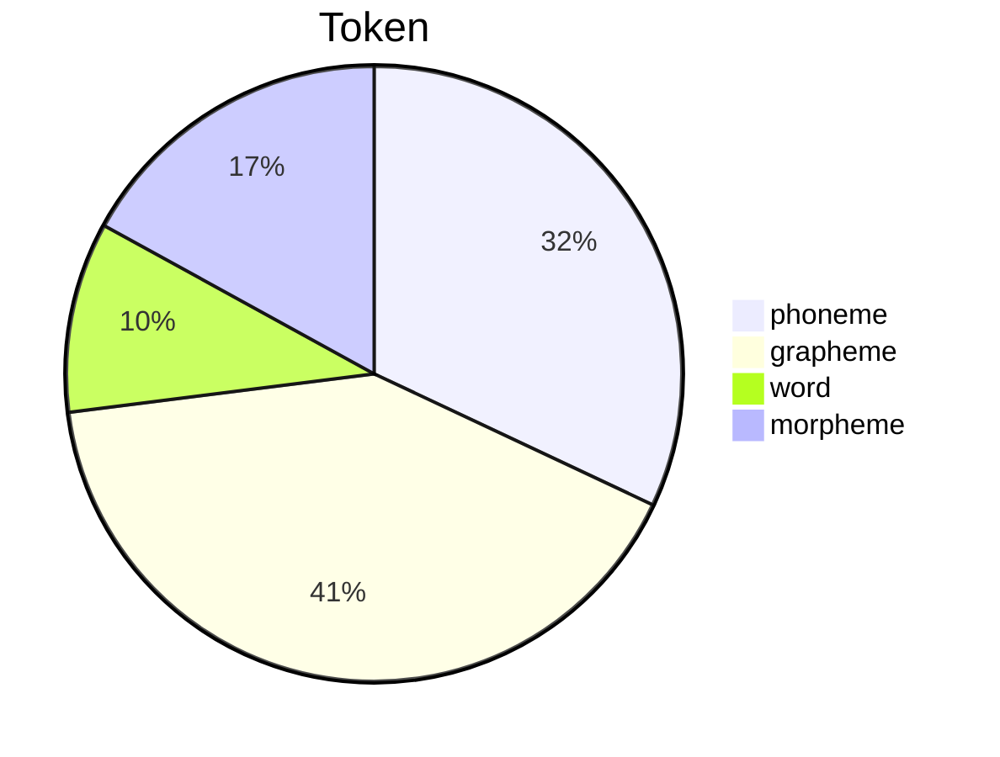
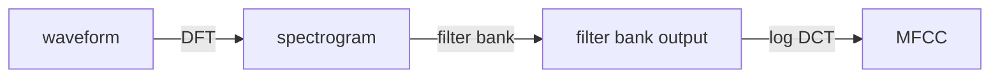
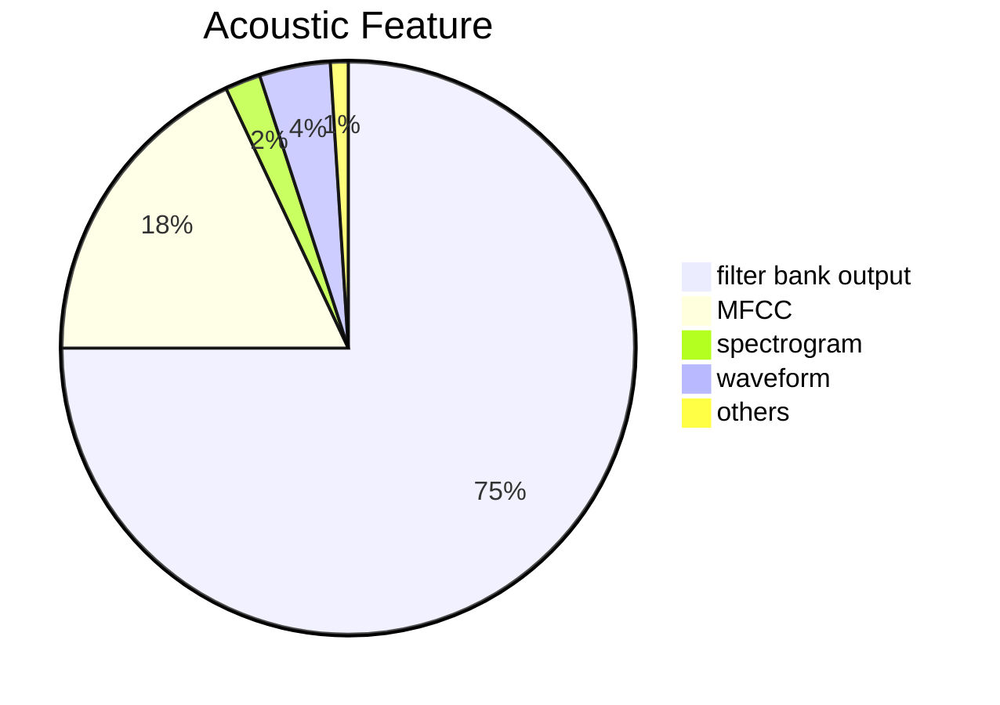

# Speech Recognition

## Overview

- speech --speech recognition--> text
  - input: speech 
    - a sequence of vector (T, D)
      - T: length
      - D: feature dimension
  - output: text
    - a sequence of token (N, V)
      - N: length
      - V: vocabulary size
  - usually, T >> N

---

- Token
  - phoneme: smallest unit of sound
    - need lexicon 
  - grapheme: smallest unit of writing
    - en: 26 letters + {_}(space) + {punctuation marks}
    - zh: 4000+ characters 
  - word: usually V>100K
  - morpheme: smallest unit of meaning
    - grapheme < **morpheme** < word
    - en: {un, happy, ness} {un, break, able}
    - linguistic or statistic
  - bytes: Language independent
    - byte pair encoding (BPE)

---

- Acoustic Feature

---

- data
  - timit 4hr
  - wsj 80hr
  - switchboard 300hr
  - librispeech 960hr
  - fisher 2000hr
- views
  - seq2seq
  - HMM
- models
  - LAS
  - CTC
  - RNN-T
  - Nerual Transducer
  - MoChA

## Listen, Attend, and Spell (LAS)

- typical seq2seq model with attention
- Listen
  - encoder
    - RNN
    - 1-D CNN
  - input: acoustic features
    - a sequence of vector (T, D)
    - $x = \{x_1, x_2, \cdots, x_T\}$
  - output: hidden states
    - a sequence of vector (T, H)
    - $h = \{h_1, h_2, \cdots, h_T\}$
  - down sampling
- Attend
  - attention
- Spell
  - decoder
    - RNN
    - training with teacher forcing
      - teacher forcing: feed the ground truth token as input to the decoder
    - inference with beam search
- limitation
  - users expect online speech

## CTC, RNN-T and more

> online Classification

- CTC decoder
  - Connectionist Temporal Classification
  - input T features, output T tokens
    - ignoring down sampling
    - take one vector as input, output one token
  - output tokens include blank token
- RNN-T
  - Recurrent Neural Aligner
  - use rnn adds dependency to CTC
- Nerual Transducer
  - input a window of chunk of features, output a chunk of tokens
- MoChA
  - Monotonic Chunkwise Attention